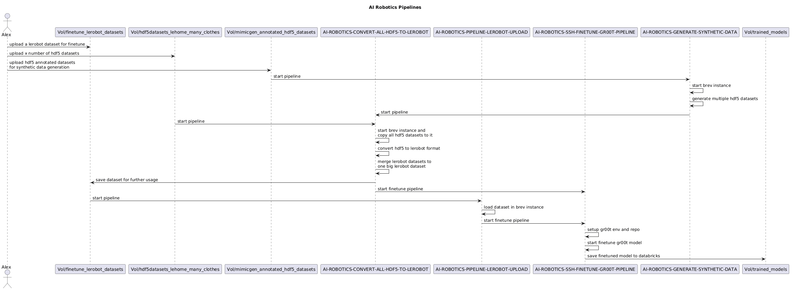

# rebel-physicalAI-pipeline

Databricks pipelines for converting, uploading, and fine-tuning robotics datasets with GR00T.

## How to Use the Pipelines

There are two main workflows depending on your dataset format:

1. **HDF5 dataset** → Convert to LeRobot format → Fine-tune GR00T
2. **LeRobot dataset** → Upload directly → Fine-tune GR00T

These workflows are powered by three Databricks pipelines:

| Pipeline                                     | Purpose                                                                     |
|----------------------------------------------|-----------------------------------------------------------------------------|
| `AI-ROBOTICS-CONVERT-HDF5-TO-LEROBOT-FORMAT` | Converts HDF5 datasets into LeRobot format and saves metrics for dashboards |
| `AI-ROBOTICS-PIPELINE-LEROBOT-UPLOAD`        | Uploads the LeRobot dataset and prepares the environment for fine-tuning    |
| `AI-ROBOTICS-SSH-FINETUNE-GR00T-PIPELINE`    | Starts the GR00T model fine-tuning process via SSH                          |
| `AI-ROBOTICS-GENERATE-SYNTHETIC-DATA`        | Generates new synthetic data from existing real recorded episodes           |

The chaining is straightforward:

- **Case 1 (HDF5):** Pipeline 1 → automatically triggers Pipeline 3
- **Case 2 (LeRobot):** Pipeline 2 → automatically triggers Pipeline 3
- Case 3 (Synthetic Data): Pipeline 4 → automatically triggers Pipeline 1 → automatically triggers Pipeline 3

> **Before running any pipeline**, you must set the Brev token in your terminal:
> ```bash
> databricks secrets put-secret brev token --string-value "your-brev-token"
> ```

---

## Case 1: Starting from an HDF5 Dataset

**Step 1 — Upload the HDF5 files**

Place your `.hdf5` files in: `Catalog → Workspace → default → Volumes → hdf5datasets_lehome_many_clothes`

**Step 2 — Upload modality files**

Upload your `modality.json` and `modality.py` files to: `Catalog → Workspace → default → Volumes → modality_files`

Then register them as secrets (include the file extensions here):

```bash
databricks secrets put-secret brev modality_json --string-value "your-modality-json-filename.json"
databricks secrets put-secret brev modality_py --string-value "your-modality-py-filename.py"
```

**Step 3 — Run Pipeline 1**

Once triggered, Pipeline 1 will convert the HDF5 file to LeRobot format, save metrics for dashboards, and then automatically trigger Pipeline 3 (the fine-tuning job).

---

## Case 2: Starting from a LeRobot Dataset

**Step 1 — Upload the LeRobot dataset**

Place your dataset folder in: `Catalog → Workspace → default → Volumes → datasets`

Then set the dataset name as a secret:

```bash
databricks secrets put-secret brev dataset_name --string-value "your-dataset-name"
```

**Step 2 — Upload modality files**

Same as Case 1 — upload your `modality.json` and `modality.py` to: `Catalog → Workspace → default → Volumes → modality_files`

```bash
databricks secrets put-secret brev modality_json --string-value "your-modality-json-filename.json"
databricks secrets put-secret brev modality_py --string-value "your-modality-py-filename.py"
```

**Step 3 — Run Pipeline 2**

Pipeline 2 will handle the upload and environment setup, then automatically trigger Pipeline 3 for fine-tuning.

---

## Secrets Reference

All secrets are organized into three scopes. To inspect any secret's value:

```bash
databricks secrets get-secret <scope-name> <key-name> | jq -r .value | base64 --decode
```

### Scope: `brev`

| Key | Description |
|-----|-------------|
| `token` | Authentication token for the Brev platform. **Must be set before every pipeline run.** |
| `api_key` | API key used by the pipeline for external service calls |
| `brev_ip` | IP address of the Brev GPU instance used for fine-tuning |
| `dataset_name` | Name of the LeRobot-format dataset to use (Case 2) |
| `hdf5_dataset_name` | Name of the HDF5 dataset to convert (Case 1, no `.hdf5` extension) |
| `instance` | Brev instance identifier for the compute environment |
| `modality_json` | Filename of the modality JSON config (include `.json` extension) |
| `modality_py` | Filename of the modality Python script (include `.py` extension) |
| `max_steps` | Maximum number of training steps for the fine-tuning run |
| `save_steps` | Checkpoint saving interval (in steps) during fine-tuning |
| `task_name` | Name/label for the current fine-tuning task |
| `ssh_private_key` | SSH private key for connecting to the Brev instance |
| `ssh_public_key` | SSH public key registered on the Brev instance |
| `email_sender` | Sender email address for pipeline notifications |
| `email_password` | Password/app-password for the sender email account |
| `email_receivers` | Comma-separated list of email addresses that receive pipeline notifications |
| `slack_webhook` | Slack incoming webhook URL for pipeline status notifications |

### Scope: `databricks`

| Key | Description |
|-----|-------------|
| `pat` | Databricks Personal Access Token used for API calls between pipelines |

### Scope: `wandb`

| Key | Description |
|-----|-------------|
| `token` | Weights & Biases API token for logging training metrics and experiment tracking |

## Visual Representation


---

## Development Workflow — Syncing Local Changes to Databricks

After editing notebooks locally, push the changes to Databricks before running. Pick the path that matches the type of change.

### Path 1 — Git roundtrip (changes you want in git history)

```bash
# edit notebook
git add <file>
git commit -m "..."
git push origin main
databricks repos update 1953498477809847 --branch main   # pull Git Folder
```

One-liner:

```bash
git push origin main && databricks repos update 1953498477809847 --branch main
```

Then in the Databricks UI: open the notebook under `/Users/lupsecristian2000@gmail.com/ROBOTICS-AI-training-pipeline/...` → Run, or trigger the job from Workflows.

### Path 2 — Bundle deploy (quick iteration, no commit needed)

```bash
databricks bundle deploy -t dev
```

Uploads all repo files to `/Workspace/Users/<you>/.bundle/physical-AI-training-pipeline/dev/files/...` and creates `[dev <you>] AI-ROBOTICS-...` jobs. Production jobs are untouched.

In the Databricks UI:
- Open the notebook at the bundle path → Run cells manually, or
- Workflows → run the `[dev <you>] AI-ROBOTICS-...` job.

Re-run `databricks bundle deploy -t dev` after each edit.

### When to use which

| Situation | Path |
|-----------|------|
| Tweak + verify on real compute, throwaway | Path 2 |
| Change you want in git history | Path 1 |
| Mixed | Iterate on Path 2, then commit + push (Path 1) once happy |

### Verify sync

```bash
git rev-parse HEAD
databricks repos get 1953498477809847 | jq -r .head_commit_id
```

Matching SHAs = Git Folder is up to date with local.

---

## Support

For questions or issues, reach out to:

- **Cristi Lupse** — cristian.lupse@rebeldot.com
- **Antonio Rad** — antonio.rad@rebeldot.com

## Credits

Developed by **Cristian Lupse** and **Antonio Rad** at [**RebelDot**](https://www.rebeldot.com/)

