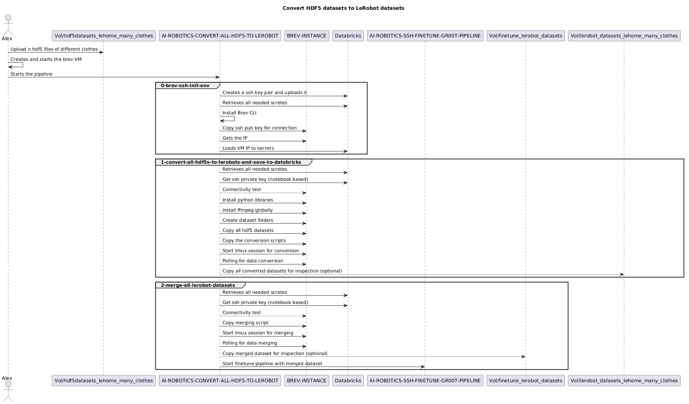

# Convert all HDF5 files to LeRobot

Takes all the hdf5 files uploaded to `workspace.default.hdf5datasets_lehome_many_clothes` or the hdf5 files generated synthetic (not implemented yet) and converts them all in LeRobot format and the it merges them into one big LeRobot dataset indexing everything to have continuity

## How it works

Databricks acts as the control plane. It doesn't run any training itself — instead, each notebook SSHs into a remote Brev GPU instance and executes commands there. Secrets (API keys, SSH keys, tokens) are pulled from Databricks secret scopes and passed as environment variables between notebooks.

Case 1: The pipeline gets the needed secrets from databricks, ssh into the instance and copies the hdf5 datasets, converts them in LeRobot format and then merges them into one big dataset.

Case 2: The pipeline takes all the hdf5 files generated by the synthetic data generation pipeline and converts them into LeRobot format and then merges them into one big dataset ready for finetune usage (not implemented yet)

## Pipeline

| Step | Notebook | What it does |
|------|----------|--------------|
| — | `secrets-template.ipynb` | Loads all secrets from Databricks and sets environment variables |
| 0 | `0-brev-ssh-env-init.ipynb` | Starts the Brev instance, sets up SSH connectivity, retrieves the instance IP |
| 1 | `1-convert-all-hdf5-to-lerobot.ipynb` | Converts multiple hdf5 datasets into multiple lerobot datasets |
| 2 | `2-merge-all-lerobot-datasets.ipynb` | Merges the multiple lerobot datasets into one big dataset |

## Notebook Details

### `secrets-template.ipynb` — Environment Setup 

> This notebook is stored in __pipeline-finetune-gr00t__ but it's used here too for secret retrieval

Template notebook that loads credentials from three Databricks secret scopes and exports them as environment variables. This must run before everything else.

| Scope | Keys |
|---|---|
| `brev` | `token`, `instance`, `brev_ip`, `ssh_public_key`, `ssh_private_key`, `dataset_name`, `max_steps`, `save_steps`, `task_name` |
| `wandb` | `token` |
| `databricks` | `pat` |

### `0-brev-ssh-env-init.ipynb` — Instance Init & SSH 

> This notebook is stored in __pipeline-finetune-gr00t__ but it's used here too for creating the ssh connection

Starts the Brev GPU instance using the Brev API, waits for it to become reachable, and retrieves its IP address. Writes the IP to `/tmp/brev_ip.txt` and loads it into `BREV_INSTANCE_IP` for subsequent notebooks. Cleans up the temp file at the end.

### `1-convert-all-hdf5-to-lerobot.ipynb` - Convert datasets

- Copies the SSH private key locally for use in SSH commands
- Creates a `RUN_ID` for metrics reasons
- Installs dependencies needed for the conversions thata re about to be made
- Copies the scripts for conversion from `workspace.default.hdf52lerobot_script_files_metrics`
- Saves metrics in delta tables for dashboards
- Saves in databricks the convertet lerobot datasets

### `2-merge-all-lerobot-datasets` - Merge datasets

- Copies the SSH private key locally for use in SSH commands
- Copies the script for merging from the same location as before
- Start tmux for merging
- Saves merged dataset in `workspace.default.finetune_lerobot_datasets`

## Visual Representation 

